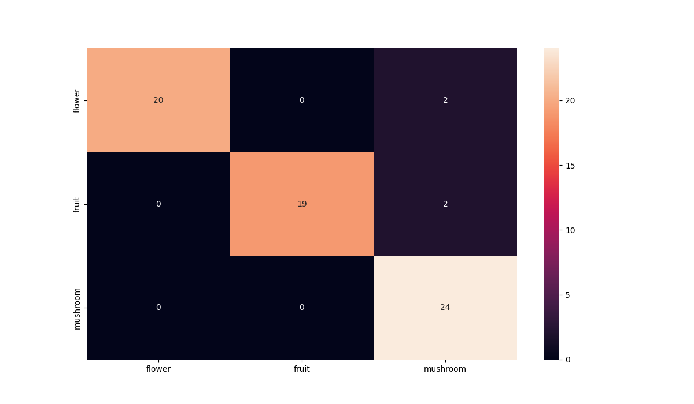

# Projeto Final - Modelos Preditivos Conexionistas

Classificação de imagens de flores, frutas ou cogumelos

### Bernardo Russo

|**Tipo de Projeto**|**Modelo Selecionado**|**Linguagem**|
|--|--|--|
|Classificação de Imagens|resnet50|PyTorch|

## Performance

O modelo treinado possui performance de **91.04%**.

### Output do bloco de treinamento

<details>
  <summary>Click to expand!</summary>
  
  ```text
Epoch 0/2
----------
Iterating through data...
train Loss: 0.8244 Acc: 0.6397
Iterating through data...
valid Loss: 0.3844 Acc: 0.9147

Epoch 1/2
----------
Iterating through data...
train Loss: 0.5013 Acc: 0.8144
Iterating through data...
valid Loss: 0.2251 Acc: 0.9380

Epoch 2/2
----------
Iterating through data...
train Loss: 0.3747 Acc: 0.8777
Iterating through data...
valid Loss: 0.1743 Acc: 0.9535

Training complete in 16m 3s
Best val Acc: 0.953488
----------
Test Acc: 0.940299
----------
  ```
</details>

### Evidências do treinamento

#### Matriz de Confusão


## Roboflow

Link do data set: [Roboflow Project - Flower, Fruit or Mushroom](https://app.roboflow.com/cesar-school-ulsik/flower_fruit_mushroom/1)

## HuggingFace

Nessa seção você deve publicar o link para o HuggingFace