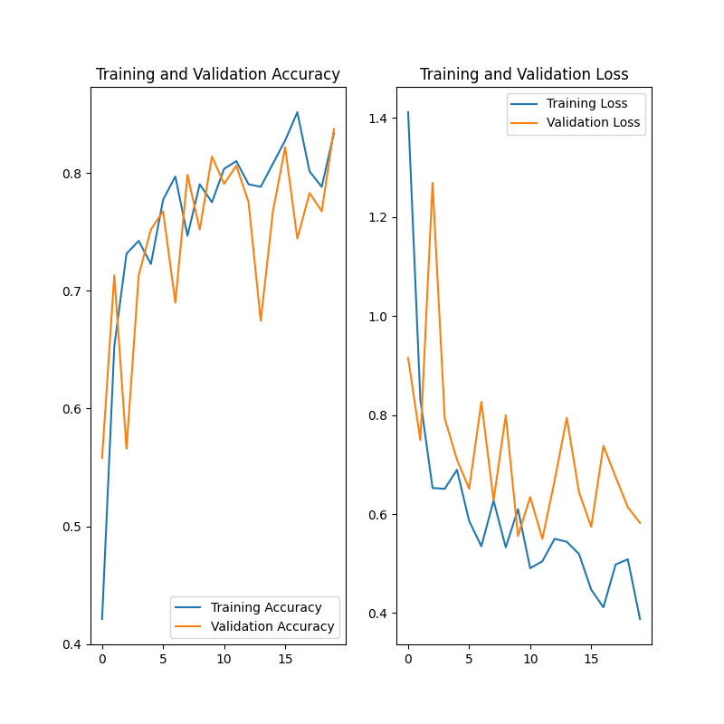

# Projeto Final - Modelos Preditivos Conexionistas

Classificação de imagens de flores, frutas ou cogumelos

### Bernardo Russo
## PyTorch
|**Tipo de Projeto**|**Modelo Selecionado**|**Linguagem**|
|--|--|--|
|Classificação de Imagens|resnet50|PyTorch|

## Performance

O modelo treinado possui performance de **94.03%**.

### Output do bloco de treinamento

<details>
  <summary>Click to expand!</summary>
  
  ```text
Epoch 0/2
----------
Iterating through data...
train Loss: 0.8244 Acc: 0.6397
Iterating through data...
valid Loss: 0.3844 Acc: 0.9147

Epoch 1/2
----------
Iterating through data...
train Loss: 0.5013 Acc: 0.8144
Iterating through data...
valid Loss: 0.2251 Acc: 0.9380

Epoch 2/2
----------
Iterating through data...
train Loss: 0.3747 Acc: 0.8777
Iterating through data...
valid Loss: 0.1743 Acc: 0.9535

Training complete in 16m 3s
Best val Acc: 0.953488
----------
Test Acc: 0.940299
----------
  ```
</details>

### Evidências do treinamento

#### Matriz de Confusão


## TensorFlow
|**Tipo de Projeto**|**Modelo Selecionado**|**Linguagem**|
|--|--|--|
|Classificação de Imagens|Keras|TensorFlow|

## Performance

O modelo treinado possui performance de **85.07%**.

### Output do bloco de treinamento

<details>
  <summary>Click to expand!</summary>
  
  ```text
Epoch 1: saving model to models/
39/39 [==============================] - 15s 343ms/step - loss: 1.4112 - accuracy: 0.4214 - val_loss: 0.9153 - val_accuracy: 0.5581
Epoch 2/20
39/39 [==============================] - ETA: 0s - loss: 0.8306 - accuracy: 0.6528
Epoch 2: saving model to models/
39/39 [==============================] - 13s 342ms/step - loss: 0.8306 - accuracy: 0.6528 - val_loss: 0.7491 - val_accuracy: 0.7132
Epoch 3/20
39/39 [==============================] - ETA: 0s - loss: 0.6526 - accuracy: 0.7314
Epoch 3: saving model to models/
39/39 [==============================] - 14s 345ms/step - loss: 0.6526 - accuracy: 0.7314 - val_loss: 1.2686 - val_accuracy: 0.5659
Epoch 4/20
39/39 [==============================] - ETA: 0s - loss: 0.6511 - accuracy: 0.7424
Epoch 4: saving model to models/
39/39 [==============================] - 14s 348ms/step - loss: 0.6511 - accuracy: 0.7424 - val_loss: 0.7927 - val_accuracy: 0.7132
Epoch 5/20
39/39 [==============================] - ETA: 0s - loss: 0.6893 - accuracy: 0.7227
Epoch 5: saving model to models/
39/39 [==============================] - 13s 344ms/step - loss: 0.6893 - accuracy: 0.7227 - val_loss: 0.7099 - val_accuracy: 0.7519
Epoch 6/20
39/39 [==============================] - ETA: 0s - loss: 0.5859 - accuracy: 0.7773
Epoch 6: saving model to models/
39/39 [==============================] - 13s 342ms/step - loss: 0.5859 - accuracy: 0.7773 - val_loss: 0.6510 - val_accuracy: 0.7674
Epoch 7/20
39/39 [==============================] - ETA: 0s - loss: 0.5349 - accuracy: 0.7969
...
Epoch 20/20
39/39 [==============================] - ETA: 0s - loss: 0.3881 - accuracy: 0.8341
Epoch 20: saving model to models/
39/39 [==============================] - 14s 352ms/step - loss: 0.3881 - accuracy: 0.8341

------------------------------------------------
3/3 [==============================] - 0s 85ms/step - loss: 0.3966 - accuracy: 0.8507
test loss: 0.3965863287448883 test acc: 0.8507462739944458
  ```
</details>

### Evidências do treinamento

#### Acurácia e Perda


## Roboflow

Link do data set: [Roboflow Project - Flower, Fruit or Mushroom](https://app.roboflow.com/cesar-school-ulsik/flower_fruit_mushroom/1)

## HuggingFace

Nessa seção você deve publicar o link para o HuggingFace